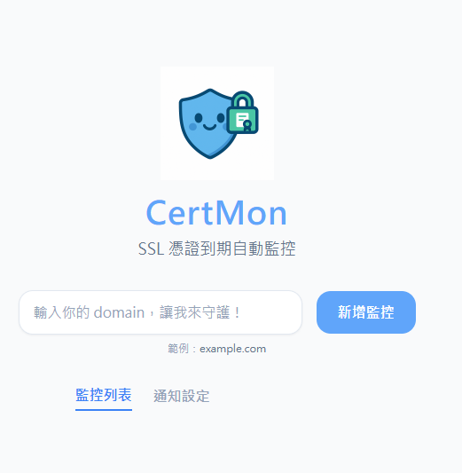
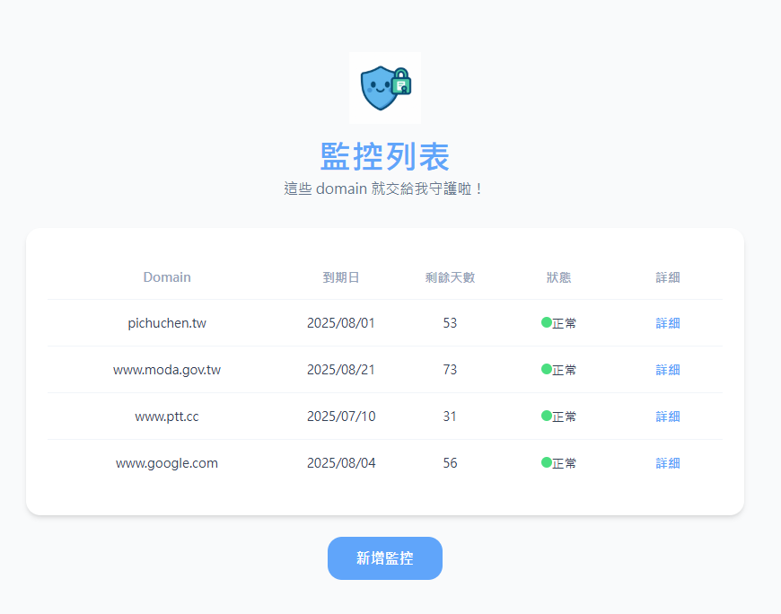
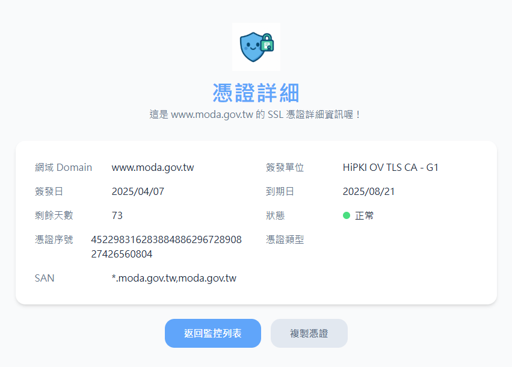

# CertMon Monorepo

本專案為 SSL 憑證到期自動監控系統，採用 Golang + Vue 3 + PostgreSQL，前後端同倉（Monorepo）管理。

## 核心功能
- 監控多個網域 SSL 憑證到期日，自動查詢與記錄
- 提供 RESTful API 查詢/新增/詳細顯示（CRUD）
- 查詢歷史 SSL 狀態紀錄（Log）
- 前端介面快速檢視、管理網域
- Docker 一鍵啟動，支援自動 migration

## 技術架構
- Backend：Golang（net/http）、PostgreSQL、Goose migration
- Frontend：Vue 3、Vite、Tailwind CSS
- DevOps：Docker Compose 管理前後端與資料庫

## 專案結構

```
CertMon/
├── backend/        # Golang server (API, 憑證檢查、排程)
├── frontend/       # Vue 3 + Tailwind 前端專案
│   └── src/
│       └── components/
│           └── CertMonHome.vue
├── docs/           # 專案文件、會議紀錄
│   └── meeting/
│       └── 20250608_01.md
├── LICENSE         # MIT License
├── README.md       # 專案說明
└── .gitignore      # Node, Go, 其他忽略規則
```

## 快速開始

### 一鍵啟動（推薦）
```bash
docker-compose up --build
```
- 會自動啟動 backend、frontend、PostgreSQL，並執行 migration。
- 預設前端 http://localhost:5173，後端 API http://localhost:8080

### .env 設定
- 請參考 `backend/.env.example` 複製為 `.env`，調整資料庫連線資訊。

### 前端 (Vue 3 + Tailwind)
```bash
cd frontend
npm install
npm run dev
```

### 後端 (Golang)
```bash
cd backend
# 複製 .env
cp .env.example .env
# 安裝套件
go mod tidy
# 執行 migration
#（docker-compose 啟動時會自動執行，手動啟動可用 goose）
# 啟動 server
go run main.go
```

## 文件資源
- [API 文件](docs/api/api_list.md)
- [DB Schema & 設計說明](docs/meeting/20250608_01.md)
- [Figma 設計稿](https://www.figma.com/design/7D4JnVFhEInYE8WLyqnd3g/CertMon?node-id=3604-1626&t=iTMPph78L3sM1lER-1)

## 系統畫面截圖

以下為 CertMon 系統的實際畫面截圖：







---

如有問題請參考 docs/meeting/20250608_01.md 或提出 Issue。
